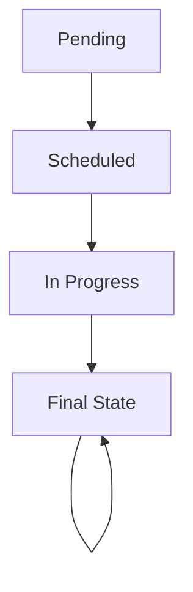

# FLIQT

FLIQT is a backend service for a Human Resource Management System, created as a demonstration project for interview purposes. The project includes basic functionalities and can be easily started using containerized deployment.

---

## **Table of Contents**

1. [Project Features](#project-features)
2. [System Requirements](#system-requirements)
3. [Installation and Execution](#installation-and-execution)
4. [Main Commands](#main-commands)
5. [Environment Variables](#environment-variables)
6. [Project Structure](#project-structure)
7. [API Endpoints](#api-endpoints)
8. [State Transition Logic](#state-transition-logic)
9. [Warnings](#warnings)

---

## **Project Features**

- Efficiently manages interview processes and statuses for HR teams.
- Containerized deployment for easy setup.
- Supports database migrations and basic testing.

---

## **System Requirements**

- **Go** 1.20 or higher
- **Docker** 20.10 or higher
- **Docker Compose** 1.29 or higher
- **Git**

---

## **Installation and Execution**

### **1. Clone the Project**

```bash
git clone https://github.com/your-username/fliqt.git
cd fliqt
```

### **2. Build and Run**

Use Docker Compose to launch all services:

```bash
make docker-compose-run
```

The API will run on `http://localhost:8080`.

---

## **Main Commands**

| Command                   | Description                         |
|---------------------------|-------------------------------------|
| `make dev-db-migrate`     | Run database migrations             |
| `make dev-db-rollback`    | Roll back the last database migration |
| `make docker-compose-run` | Start all services with Docker Compose |
| `make clean`              | Clean up Docker resources           |

---

## **Environment Variables**

Create a `.env` file in the project root directory and fill it with the following variables:

```env
DB_HOST=mysql
DB_PORT=3306
DB_USER=root
DB_PASSWORD=rootpassword
DB_NAME=fliqt

REDIS_URL=redis://redis:6379
DEBUG=true
```
---

## **Project Structure**

```plaintext
fliqt/
│
├── Dockerfile                 # Docker build configuration
├── docker-compose.yml         # Multi-service orchestration
├── makefile                   # Convenient command execution
├── go.mod                     # Go module configuration
├── go.sum                     # Go dependencies checksum
├── config/                    # Configuration logic
├── cmd/                       # Application entry points
│   ├── main/                  # Service startup logic (main.go)
│   └── migrate/               # Migration tool entry point
├── internal/                  
│   ├── api/                   # API routing and handlers
│   │   └── interview/         # Interview-related API routes
│   ├── model/                 # Data models
│   ├── middleware/            # Middleware logic
│   └── services/              # Business logic layer
```

---

## **API Endpoints**

The following endpoints are available in the system:

### **Interview Management**

1. **List Interviews**
    - **Endpoint**: `GET /api/interviews`
    - **Description**: Fetches a list of interviews with optional filtering (candidate name, position, status).

2. **Get Interview by ID**
    - **Endpoint**: `GET /api/interviews/:id`
    - **Description**: Retrieves detailed information about a specific interview.

3. **Create Interview**
    - **Endpoint**: `POST /api/interviews`
    - **Description**: Creates a new interview record.
    - **Payload**:
      ```json
      {
        "candidate_name": "John Doe",
        "position": "Backend Engineer",
        "status": 1,
        "scheduled_time": "2024-01-10T10:00:00Z",
        "notes": "First round technical interview."
      }
      ```

4. **Update Interview**
    - **Endpoint**: `PUT /api/interviews/:id`
    - **Description**: Updates an existing interview's status, scheduled time, or notes.
    - **Payload**:
      ```json
      {
        "status": 2,
        "scheduled_time": "2024-01-11T15:00:00Z",
        "notes": "Updated notes for the interview."
      }
      ```

5. **Delete Interview**
    - **Endpoint**: `DELETE /api/interviews/:id`
    - **Description**: Deletes an interview record by its ID.

---

## **State Transition Logic**

The Interview status transitions are managed using a **State Machine** to ensure proper flow between states. The supported transitions are as follows:

| Current Status      | Next Status        |
|----------------------|---------------------|
| Pending             | Scheduled          |
| Scheduled           | In Progress        |
| In Progress         | Completed          |
| Completed           | None (Final State) |

- Each state enforces valid transitions, ensuring that an invalid state change (e.g., skipping states) is not possible.

### **State Transition Diagram**



The state machine logic is implemented in the `services/interview_state.go` file.

---

## **Future Enhancements**

- Add user authentication and authorization (JWT).
- Provide more unit tests to improve test coverage.
- Enhance API documentation with tools like Swagger.

---

## **Warnings**

⚠️ **Important:**
- The `.env` file provided in this repository is **not secure** and should not be used in production environments.
- For production, ensure environment variables are managed securely and secrets are not exposed.

---